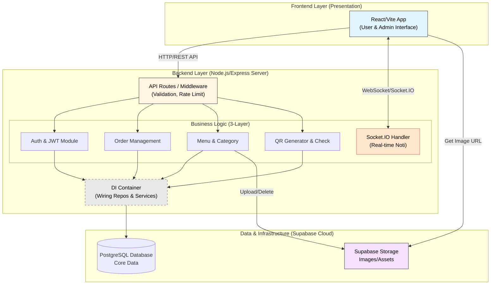

# System Architecture

```mermaid
flowchart TB
    subgraph Frontend["Frontend Layer (Presentation)"]
        ClientApp["React/Vite App<br/>(User & Admin Interface)"]
    end
    
    subgraph Backend["Backend Layer (Node.js/Express Server)"]
        direction TB
        APIRouter["API Routes / Middleware<br/>(Validation, Rate Limit)"]
        
        subgraph BusinessLogic["Business Logic (3-Layer)"]
            AuthMod["Auth & JWT Module"]
            OrderMod["Order Management"]
            MenuMod["Menu & Category"]
            QRMod["QR Generator & Check"]
            SocketMod["Socket.IO Handler<br/>(Real-time Noti)"]
        end
        
        DIContainer["DI Container<br/>(Wiring Repos & Services)"]
    end
    
    subgraph Infrastructure["Data & Infrastructure (Supabase Cloud)"]
        PostgresDB[("PostgreSQL Database<br/>Core Data")]
        Storage["Supabase Storage<br/>Images/Assets"]
    end
    
    ClientApp -- "HTTP/REST API" --> APIRouter
    ClientApp <-- "WebSocket/Socket.IO" --> SocketMod
    APIRouter --> AuthMod & OrderMod & MenuMod & QRMod
    AuthMod --> DIContainer
    OrderMod --> DIContainer
    MenuMod --> DIContainer
    QRMod --> DIContainer
    ClientApp -- "Get Image URL" --> Storage
    MenuMod -- "Upload/Delete" --> Storage
    DIContainer --> PostgresDB

    style ClientApp fill:#e1f5ff,stroke:#333,color:#000
    style SocketMod fill:#ffe6cc,stroke:#d66,color:#000
    style APIRouter fill:#fff4e1,stroke:#333,color:#000
    style DIContainer fill:#e8e8e8,stroke:#666,stroke-dasharray: 5 5,color:#000
    style Storage fill:#f5e1ff,stroke:#333,color:#000
```